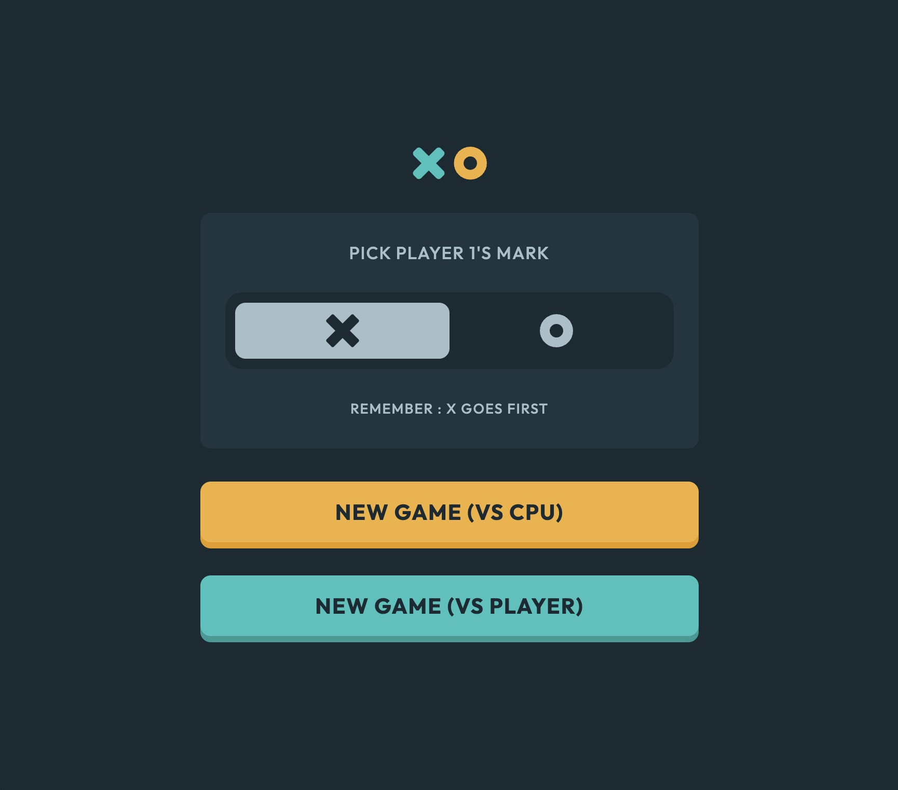

# Frontend Mentor - Tic Tac Toe solution

This is a solution to the [Tic Tac Toe challenge on Frontend Mentor](https://www.frontendmentor.io/challenges/tic-tac-toe-game-Re7ZF_E2v). Frontend Mentor challenges help you improve your coding skills by building realistic projects. 

## Table of contents

- [Overview](#overview)
  - [The challenge](#the-challenge)
  - [Screenshot](#screenshot)
  - [Links](#links)
- [My process](#my-process)
  - [Built with](#built-with)
  - [What I learned](#what-i-learned)
  - [Continued development](#continued-development)
- [Author](#author)

**Note: Delete this note and update the table of contents based on what sections you keep.**

## Overview

### The challenge

Users should be able to:

- View the optimal layout for the game depending on their device's screen size
- See hover states for all interactive elements on the page
- Play the game either solo vs the computer or multiplayer against another person
- **Bonus 1**: Save the game state in the browser so that it’s preserved if the player refreshes their browser
- **Bonus 2**: Instead of having the computer randomly make their moves, try making it clever so it’s proactive in blocking your moves and trying to win

### Screenshot

### Links

- Solution URL: [Github](https://github.com/remyboire/Tic-tac-toe)
- Live Site URL: [Github Pages](https://remyboire.github.io/Tic-tac-toe/public/)

## My process

### Built with

- Flexbox
- CSS Grid
- Mobile-first workflow
- SASS

### What I learned

Although it is not perfect, it has been a good way to learn a bit of algorithmic thinking.
I tried to make the computer play smart and block the player's moves.
CPU plays randomly, but if its opponent can win, it will block it, otherwise, if CPU can win, it will play to win.
This is basic, but seems to get people into enough trouble.

### Continued development

I didn't use localstorage to save the game state and it would be a good idea to do so in the future.

## Author

- Website - [Rémy Boiré](https://www.remyboire.fr)
- Frontend Mentor - [@remyboire](https://www.frontendmentor.io/profile/remyboire)

